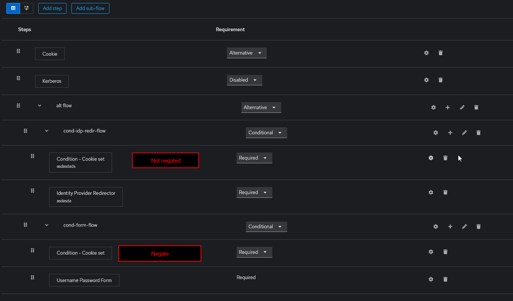

I use this condition to control what is being shown to the user.

I can use it to distinguish use cases by cookies, for the users with the cookie I display the login form
For the users without I directly redirect to another IDP

This is not to be used for security related conditions.

https://github.com/keycloak/keycloak/blob/26.1.2/services/src/main/java/org/keycloak/authentication/authenticators/browser/CookieAuthenticator.java

https://github.com/keycloak/keycloak/blob/640f3b178dad76c91dd07e6336e1c3b311de7156/services/src/main/java/org/keycloak/protocol/RestartLoginCookie.java#L126

https://github.com/keycloak/keycloak/blob/main/server-spi-private/src/main/java/org/keycloak/cookie/CookieType.java#L17

